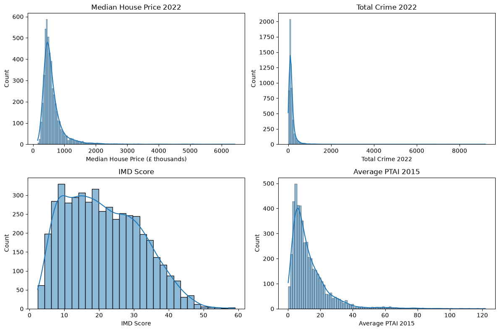
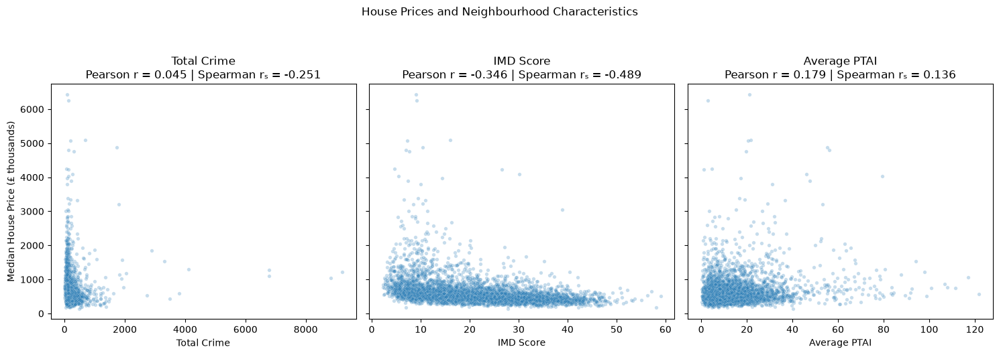
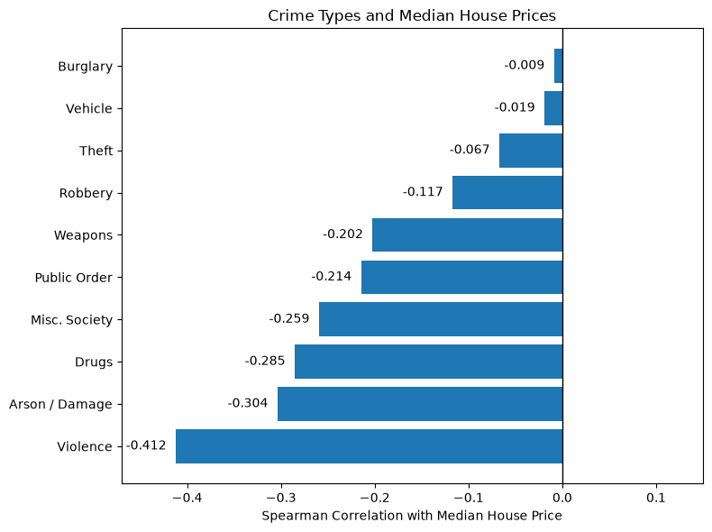
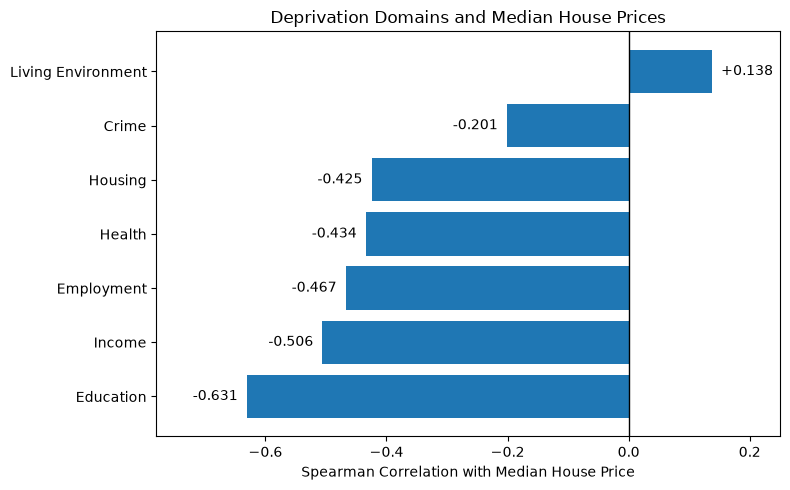
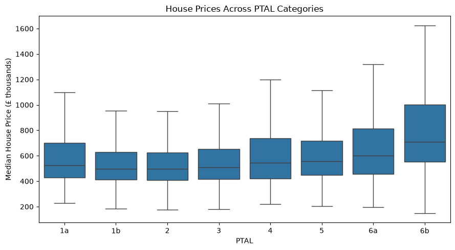

# London House Prices: Crime, Deprivation and Public Transport Accessibility

## Project Overview

House prices vary substantially across London, but location alone does not explain these differences. This project investigates how three neighbourhood characteristics — **crime, deprivation and public transport accessibility** — are associated with median house prices across London.

The analysis is carried out at **Lower Layer Super Output Area (LSOA)** level, providing much greater geographical detail than a borough-level analysis. The final dataset contains **4,746 London LSOAs**.

### Research Question

**Which neighbourhood characteristic — crime, deprivation or public transport accessibility — is most strongly associated with median house prices across London LSOAs?**

Short answer: deprivation is the characteristic most strongly associated with house prices, followed by transport accessibility; crime has a small adjusted association.

The project combines data preparation, exploratory data analysis, correlation analysis, hypothesis testing (a Kruskal–Wallis test across PTAL categories and significance tests for the regression coefficients) and multiple regression to examine both the individual and adjusted relationships between these characteristics and house prices.

---

## Data Sources

Four publicly available datasets were combined:

| Dataset | Source | Period Used | Purpose |
|---|---|---|---|
| Median House Prices | Office for National Statistics (ONS) | 2022 | Median residential property price by LSOA |
| Recorded Crime | Metropolitan Police Service | 2022 | Total crime and individual crime categories |
| Index of Multiple Deprivation (IMD) | UK Government | 2019 | Overall deprivation and individual deprivation domains |
| Public Transport Accessibility | Transport for London / London Datastore | 2015 | Average PTAI and PTAL category |

The datasets use different time periods, which is an important limitation of the analysis.

---

## Data Preparation

The datasets required several preparation steps before they could be combined.

### House Prices

The analysis uses the median house price for the year ending December 2022. 

There were **339 missing December 2022 house-price values**. Where sufficient recent information was available, missing values were estimated using:

- interpolation between September 2022 and March 2023;
- the closest available recent house-price observation adjusted using the median price change within the same London borough.

This allowed **253 missing prices to be estimated**. The remaining **86 LSOAs** did not have sufficient recent information and were excluded from the final analysis.

### Crime Data

Monthly Metropolitan Police crime records were aggregated to annual totals for 2022. Crime was retained both as:

- **Total Crime 2022**
- individual offence categories such as violence against the person, theft, burglary and drug offences.

A major challenge was that the crime dataset uses **LSOA 2021 geography**, while the other datasets use **LSOA 2011 geography**.

The official ONS LSOA 2011–2021 lookup was used to convert the geographical codes. A further **181 LSOA 2021 codes in the crime dataset** were not present in the standard lookup, so these were matched using the **ONS Postcode Directory**, assigning each missing LSOA 2021 to the LSOA 2011 containing the majority of its postcodes.

Where a 2021 LSOA corresponded to more than one 2011 LSOA, its crime counts were **split equally between the corresponding 2011 LSOAs** before being aggregated to LSOA 2011 level.

Three City of London LSOAs were excluded because the City is policed separately and is not covered by the Metropolitan Police dataset.

### Final Dataset

After cleaning and merging the four sources, the final analytical dataset contains:

- **4,746 LSOAs**
- **27 variables**
- **0 duplicate LSOAs**
- **0 missing values**

The prepared dataset is saved as `data/final_df.csv`.

---

## Analysis

The analysis was carried out in several stages.

### Exploratory Analysis

The distributions of house prices, crime, deprivation and transport accessibility were examined first.



House prices and total crime are strongly right-skewed, with a small number of extreme observations. Public transport accessibility is also positively skewed, while the IMD Score has a much more balanced distribution.

Both **Pearson and Spearman correlations** were used because several variables contain extreme values and non-linear patterns.



### Crime

Total crime has a relatively weak relationship with house prices, but further investigation showed that this hides important differences between areas and crime types.

Some high-crime LSOAs, particularly in central London, have both high crime counts and high house prices. These areas are often dominated by theft and weaken the overall crime–price relationship.
A sensitivity check was carried out by temporarily excluding LSOAs that were both high-crime and theft-heavy. Pearson correlation changed from 0.045 to -0.189, while Spearman correlation changed from -0.251 to -0.356, showing that these areas weaken the overall negative relationship. However, they represent genuine characteristics of London neighbourhoods rather than data errors, so they were retained in the main analysis. This also highlights a limitation of using total crime as a single measure.

Individual crime categories show substantially different patterns. **Violence Against the Person** has the strongest negative association with house prices (*rₛ* = -0.412), while theft, burglary and vehicle crime show much weaker relationships.



This demonstrates that **total crime alone provides a limited picture of neighbourhood crime**.

### Deprivation

Deprivation shows the clearest relationship with house prices. The overall IMD Score is negatively associated with property prices, meaning that more deprived neighbourhoods generally have lower median house prices.

The strength — and in one case the direction — of the relationship varies considerably across deprivation domains:



Education deprivation shows the strongest negative relationship with house prices, while the Crime domain has a much weaker relationship and Living Environment deprivation shows a small positive association.

### Public Transport Accessibility

Public transport accessibility has a weaker positive relationship with house prices across London.

A Kruskal–Wallis test shows that house prices differ significantly across PTAL categories (*H* = 167.23, *p* < 0.001), with the highest accessibility categories generally having higher median house prices, although the pattern is not completely linear.



---

## Multiple Regression

A multiple regression model was used to examine crime, deprivation and public transport accessibility simultaneously.

Because house prices, total crime and PTAI are strongly right-skewed, they were log-transformed before modelling. IMD Score was retained on its original scale. Using the transformed variables, the model is:

**Log House Price ~ Log Crime + IMD Score + Log PTAI**

The model explains approximately **26.6% of the variation in log house prices** (*R²* = 0.266, adjusted *R²* = 0.265).

After accounting for the other characteristics:

- a **10-point higher IMD Score** is associated with house prices approximately **17.8% lower**;
- a **10% increase in PTAI** is associated with house prices approximately **1.3% higher**;
- a **10% increase in total crime** is associated with house prices approximately **0.3% lower**.

Because these changes are measured on different scales, standardised coefficients were used to compare the relative strength of the relationships:

| Characteristic | Standardised coefficient |
|---|---:|
| Deprivation | **-0.490** |
| Public transport accessibility | **0.266** |
| Total crime | **-0.043** |

**Deprivation therefore has the strongest adjusted association with house prices**, while total crime has a much smaller association.

Model diagnostics identified heteroskedasticity, so HC3 robust standard errors were used for the significance tests of the regression coefficients. All three characteristics were statistically significant at the 5% level.

A borough sensitivity check was also performed. Crime and deprivation coefficients changed very little after borough was included in the model. In contrast, the PTAI coefficient changed from positive (0.1376) to a small negative value (-0.0272), suggesting that the positive London-wide relationship is partly explained by the concentration of highly accessible areas in more expensive inner London boroughs.

---

## Key Findings

1. **Deprivation has the strongest and most consistent relationship with house prices.** More deprived areas generally have lower property values, and this relationship remains strong after accounting for crime, transport accessibility and borough.

2. **Crime is more complex than the total count suggests.** Total crime has only a small adjusted association with house prices, while individual crime types show very different patterns. Violent crime has a much stronger negative relationship than theft or burglary.

3. **Better public transport is associated with higher prices across London, but location matters.** The positive London-wide relationship falls close to zero after borough differences are taken into account.

4. **The three neighbourhood characteristics explain only part of the variation in prices.** The regression explains 26.6% of the variation in log house prices, indicating that property characteristics and other neighbourhood and geographical factors are also important.

These findings represent **statistical associations rather than causal effects**.

---

## Limitations

Several limitations should be considered when interpreting the results:

- The datasets relate to different years: house prices and crime are from 2022, IMD from 2019 and public transport accessibility from 2015.
- Property characteristics such as size, property type and tenure are not included.
- School quality and direct distance from central London are not measured.
- Total crime is the number of recorded offences, not a rate. LSOAs have broadly similar populations, so counts are reasonably comparable between residential areas, but in high-footfall commercial and visitor areas (such as parts of Westminster) they also reflect visitors and workers, not only residents.
- IMD already contains a crime domain, creating some overlap between the crime and deprivation measures.
- House-price imputation and conversion between LSOA 2021 and 2011 geography introduce some additional uncertainty.
- Neighbouring LSOAs are likely to share characteristics, so observations may not be completely independent.
- The analysis is observational and cross-sectional, so the results should not be interpreted as causal effects.

---

## Repository Structure

```text
House_prices_analysis/
│
├── analysis.ipynb
├── data_preparation.ipynb
├── README.md
├── requirements.txt
│
└── data/
    └── final_df.csv
|    
└── images/
    └── crime_types.png
        deprivation_domains.png
        distributions.png
        main_relationships.png
        PTAL_categories.png
        
```

- `data_preparation.ipynb` – downloads, cleans and combines the original datasets and creates the final analytical dataset
- `analysis.ipynb` — exploratory analysis, correlation analysis, statistical testing, regression modelling, diagnostics and conclusions
- `data/final_df.csv` – cleaned dataset used by the analysis notebook
- `requirements.txt` – Python dependencies required to reproduce the project

---

## Tools and Libraries

**Python, pandas, NumPy, Matplotlib, Seaborn, SciPy, statsmodels** and **requests** were used for data preparation, analysis, statistical modelling and visualisation.

---

## Reproducing the Analysis

1. Clone the repository and install the required packages: ` pip install -r requirements.txt `


2. *(Optional)* To rebuild the dataset from the original sources, run `data_preparation.ipynb` first. This requires an internet connection and downloads several large public datasets (ONS house prices, Metropolitan Police crime data, IMD and PTAL files), so it can take a while. The notebook skips any file that has already been downloaded.
3. Open `analysis.ipynb` and run all cells. The prepared dataset (`data/final_df.csv`) is already included in the repository, so you can go straight to this step without running the data preparation.

